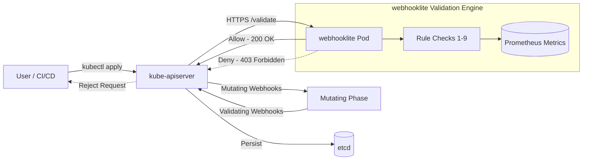

# webhooklite

[](https://golang.org/)
[](https://kubernetes.io/)
[](LICENSE)

Production-ready Kubernetes admission webhook that validates pods **BEFORE** they enter the cluster. Enforces 9 security policies out-of-the-box to prevent insecure workloads from running.

---

## 📑 Table of Contents

- [Overview](#overview)
- [Architecture](#architecture)
- [9 Security Rules](#9-security-rules)
- [Endpoints & Monitoring](#endpoints--monitoring)
- [Project Structure](#project-structure)
- [Quick Start](#quick-start)
- [Deployment Options](#deployment-options)
  - [Option A: Kubernetes Manifests](#option-a-kubernetes-manifests)
  - [Option B: Helm Chart](#option-b-helm-chart)
  - [Option C: GitOps via ArgoCD](#option-c-gitops-via-argocd)
- [Development & Local Build](#development--local-build)
- [Testing Policies](#testing-policies)
  - [❌ Should be BLOCKED](#-should-be-blocked)
  - [✅ Should be ALLOWED](#-should-be-allowed)
- [Troubleshooting](#troubleshooting)

---

## Overview

**webhooklite** is a lightweight, zero-dependency admission controller that intercepts pod creation and update requests at the Kubernetes API server level. Unlike static vulnerability scanners or runtime agents, webhooklite acts as an active gatekeeper that rejects non-compliant pods before scheduling.

### Key Benefits
- **Active Admission Control** - Blocks insecure pods at admission time, preventing misconfigured resources from touching etcd.
- **Zero Runtime Overhead** - No sidecars, kernel modules, or node daemons required.
- **Built-in Observability** - Prometheus metrics on admission decisions and dedicated `/healthz` endpoints.
- **Graceful Shutdown & Resilience** - Proper POSIX signal handling with timeout context for zero-downtime rollouts.
- **Flexible Deployment** - Ready-to-use Manifests, Helm Chart, and ArgoCD GitOps configuration.

---

## Architecture



1. A client submits a Pod manifest via `kubectl` or CI/CD.
2. The `kube-apiserver` sends an `AdmissionReview` JSON payload over HTTPS to webhooklite (`/validate`).
3. webhooklite evaluates all 9 security policies and increments Prometheus metrics.
4. If compliant, an admission response with `allowed: true` is returned and etcd persists the Pod.
5. If any rule fails, the request is rejected with HTTP `403 Forbidden` detailing all rule violations.

---

## 9 Security Rules

| # | Rule                            | Blocks                                                            | Why                                                                           |
|---|---------------------------------|-------------------------------------------------------------------|-------------------------------------------------------------------------------|
| 1 | **No Privileged Containers**    | `securityContext.privileged: true`                                | Prevents container escapes and root access to the host kernel.                |
| 2 | **No Untagged / Latest Images** | `image: *:latest` or images without tag                           | Ensures version pinning and immutable, reproducible deployments.              |
| 3 | **Resource Limits Required**    | Missing `resources.limits`                                        | Prevents "noisy neighbor" resource starvation and DoS attacks.                |
| 4 | **runAsNonRoot Required**       | Missing or `runAsNonRoot: false`                                  | Minimizes privilege escalation attack surface inside the container.           |
| 5 | **No Privilege Escalation**     | `allowPrivilegeEscalation: true`                                  | Prevents gaining more privileges than the parent process (`setuid` binaries). |
| 6 | **No Host Access**              | `hostNetwork: true` / `hostPID: true`                             | Prevents snooping host network interfaces and host process namespaces.        |
| 7 | **Allowed Registries Only**     | Registries not in `[docker.io, registry.k8s.io, gcr.io, ghcr.io]` | Protects cluster from unvetted images and supply chain attacks.               |
| 8 | **No Docker Socket Mounting**   | `hostPath: /var/run/docker.sock`                                  | Blocks container breakout into the host daemon.                               |
| 9 | **Require `app` Label**         | Missing `metadata.labels.app`                                     | Enforces resource tagging, traceability, and observability standards.         |

---

## Endpoints & Monitoring

webhooklite listens on port **`:8443`** (HTTPS) and exposes the following endpoints:

| Path        | Method | Purpose                                                            |
|-------------|--------|--------------------------------------------------------------------|
| `/validate` | `POST` | Kubernetes admission webhook handler (receives `AdmissionReview`). |
| `/healthz`  | `GET`  | Liveness and readiness probe endpoint (returns `200 ok`).          |
| `/metrics`  | `GET`  | Prometheus metrics endpoint.                                       |
| `/`         | `GET`  | Service overview & list of available endpoints.                    |

### Prometheus Metrics

webhooklite exports admission telemetry using the standard Prometheus format:

```text
# HELP webhooklite_requests_total Total number of admission review requests processed by webhooklite.
# TYPE webhooklite_requests_total counter
webhooklite_requests_total{result="allowed"} 42
webhooklite_requests_total{result="denied"} 7
```

---

## Project Structure

```text
webhooklite/
├── cmd/
│   └── webhooklite/
│       ├── main.go               # Webhook HTTP server & 9 validation rules
│       └── main_test.go          # Unit tests for admission rules
├── deploy/
│   ├── deployment.yaml           # Deployment & Service manifests
│   ├── webhook-config.yaml       # ValidatingWebhookConfiguration
│   └── good-pod.yaml             # Compliant pod example
├── helm/
│   └── webhooklite/              # Production Helm 3 chart
│       ├── Chart.yaml
│       ├── values.yaml
│       └── templates/
├── argocd/
│   └── argocd-app.yaml           # ArgoCD Application CRD for GitOps
├── scripts/
│   ├── generate-certs.sh         # Linux/macOS certificate generator
│   ├── generate-certs.ps1        # Windows PowerShell certificate generator
│   └── deploy.ps1                # Automated PowerShell deployment script
├── Dockerfile                    # Multi-stage rootless container build
├── go.mod                        # Go module dependencies
└── README.md
```

---

## Quick Start

### 1. Clone the repository
```bash
git clone https://github.com/cooler-SAI/webhooklite.git
cd webhooklite
```

### 2. Generate TLS Certificates
Kubernetes requires admission webhooks to communicate exclusively over TLS with a valid CA bundle:

```bash
# On Linux / macOS:
./scripts/generate-certs.sh

# On Windows (PowerShell):
.\scripts\generate-certs.ps1
```

### 3. Deploy
```bash
kubectl apply -f deploy/
```

---

## Deployment Options

### Option A: Kubernetes Manifests
Deploy directly using raw manifests:

```bash
# 1. Apply webhook deployment and service
kubectl apply -f deploy/deployment.yaml

# 2. Register ValidatingWebhookConfiguration
kubectl apply -f deploy/webhook-config.yaml
```

### Option B: Helm Chart
Install via Helm with custom certificates:

```bash
helm install webhooklite ./helm/webhooklite \
  --namespace webhook-system \
  --create-namespace \
  --set-file secret.tls.crt=certs/tls.crt \
  --set-file secret.tls.key=certs/tls.key \
  --set-file validatingWebhook.clientConfig.caBundle=certs/ca.crt
```

### Option C: GitOps via ArgoCD
Deploy declaratively via ArgoCD:

```bash
kubectl apply -f argocd/argocd-app.yaml
```

---

## Development & Local Build

### Prerequisites
- Go 1.22+
- Docker
- `kubectl` connected to a test cluster (e.g., Kind, Minikube, or k3s)

### Run Unit Tests
```bash
# Run all unit tests
go test -v ./...

# Run tests with race detection and coverage
go test -race -cover ./...
```

### Build Binary
```bash
go build -o bin/webhooklite ./cmd/webhooklite
```

### Build Docker Image
```bash
docker build -t webhooklite:latest .
```

---

## Testing Policies

### ❌ Should be BLOCKED

#### Rule 1: Privileged container
```bash
kubectl run bad-priv --image=nginx:1.21 --privileged=true
```

#### Rule 2: Latest tag or untagged
```bash
kubectl run bad-latest --image=nginx:latest
```

#### Rule 3: No resource limits
```bash
kubectl run bad-nolimits --image=nginx:1.21
```

#### Rule 4: Root user
```bash
kubectl run bad-root --image=nginx:1.21 --overrides='{"spec":{"securityContext":{"runAsNonRoot":false}}}'
```

#### Rule 5: Privilege escalation
```bash
kubectl run bad-escalation --image=nginx:1.21 --overrides='{"spec":{"containers":[{"name":"nginx","image":"nginx:1.21","securityContext":{"allowPrivilegeEscalation":true}}]}}'
```

#### Rule 6: Host network or Host PID
```bash
kubectl run bad-hostnet --image=nginx:1.21 --overrides='{"spec":{"hostNetwork":true}}'
```

#### Rule 7: Unauthorized registry
```bash
kubectl run bad-registry --image=evilcorp.io/malware:1.0
```

#### Rule 8: Docker socket mounting
```bash
kubectl run bad-dockersock --image=nginx:1.21 --overrides='{
  "spec": {
    "securityContext": {"runAsNonRoot": true},
    "containers": [{
      "name": "nginx",
      "image": "nginx:1.21",
      "resources": {"limits": {"cpu": "100m", "memory": "128Mi"}},
      "volumeMounts": [{"mountPath": "/var/run/docker.sock", "name": "dockersock"}]
    }],
    "volumes": [{"name": "dockersock", "hostPath": {"path": "/var/run/docker.sock"}}]
  }
}'
```

#### Rule 9: Missing `app` label
```bash
kubectl run bad-label --image=nginx:1.21 --overrides='{
  "spec": {
    "securityContext": {"runAsNonRoot": true},
    "containers": [{
      "name": "nginx",
      "image": "nginx:1.21",
      "resources": {"limits": {"cpu": "100m", "memory": "128Mi"}}
    }]
  }
}'
```

---

### ✅ Should be ALLOWED

```bash
kubectl apply -f deploy/good-pod.yaml
```

Or via `kubectl run`:

```bash
kubectl run good-pod --image=nginx:1.21 --overrides='{
  "metadata": {
    "labels": {"app": "good-pod"}
  },
  "spec": {
    "securityContext": {
      "runAsNonRoot": true
    },
    "containers": [{
      "name": "nginx",
      "image": "nginx:1.21",
      "resources": {
        "limits": {"cpu": "100m", "memory": "128Mi"}
      },
      "securityContext": {
        "allowPrivilegeEscalation": false
      }
    }]
  }
}'
```

---

## Troubleshooting

### Check Webhook Logs
```bash
kubectl logs -l app=webhooklite -n default -f
```

### Inspect ValidatingWebhookConfiguration
```bash
kubectl get validatingwebhookconfigurations -o wide
kubectl describe validatingwebhookconfiguration webhooklite-validation
```

### Common Issues
- **`x509: certificate signed by unknown authority`**: Ensure `caBundle` in your `ValidatingWebhookConfiguration` matches base64-encoded `certs/ca.crt` or `certs/tls.crt`.
- **System Namespaces Blocked**: Ensure your `ValidatingWebhookConfiguration` excludes namespaces like `kube-system`, `argocd`, and `webhook-system` using `namespaceSelector`.
- **Timeout contacting webhook**: Ensure webhook service port mapping (443 -> 8443) and firewall/CNI network policies permit traffic from the API server to the webhook pod.
